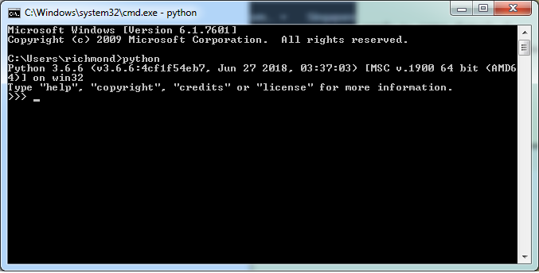

# User Guide:

This page contains a tutorial on <b>how to use setup and run the device simulators</b>. 

0. Access the IoT portal.
1. Create an account and login.
2. Register a device (Registering a device will return a unique DEVICE_ID, DEVICE_SERIAL, DEVICE_MACADD).
3. Setup and run the device simulator using the DEVICE_ID, DEVICE_SERIAL, DEVICE_MACADD

### Setup

1. Install the latest Python 3.X.X from https://www.python.org/downloads/

    After installation, open a command prompt and type "Python". You should see the version of the "Python" installed.
    Note that I'm using Python 3.6.6.

2. Install the required python libraries of the application:

    - pip install -r requirements.py.txt OR
    - python pip install -r requirements.py.txt

### Run

1. Update DEVICE_ID, DEVICE_SERIAL, DEVICE_MACADD and DEVICE_SECRETKEY in <b>device_simulator.py.bat</b> (or device_simulator.py.sh for Linux/MacOS)

   NOTES: 
   
    To get a DEVICE_ID, DEVICE_SERIAL, DEVICE_MACADD, you must first register a device in the IoT Portal.
    
   
    

2. Dont forget to update HOST and DEVICE_SECRETKEY.

3. Run <b>device_simulator.py.bat</b> (or device_simulator.py.sh for Linux/MacOS)

