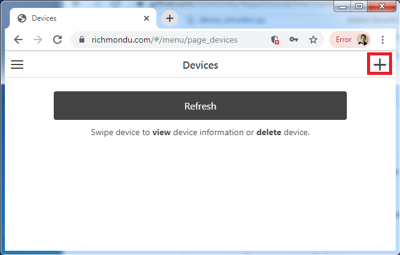
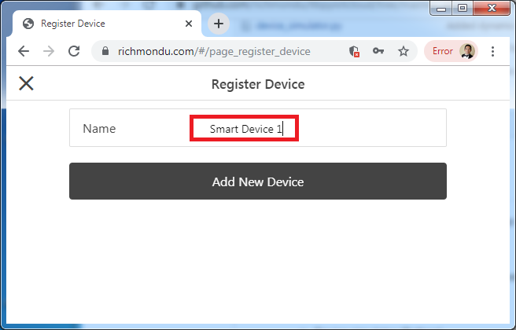
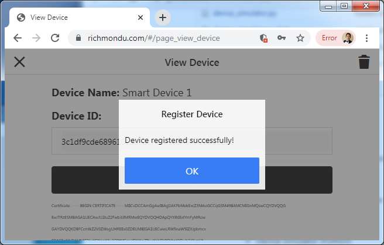
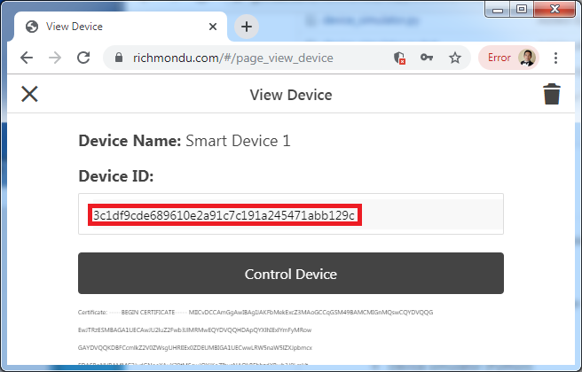
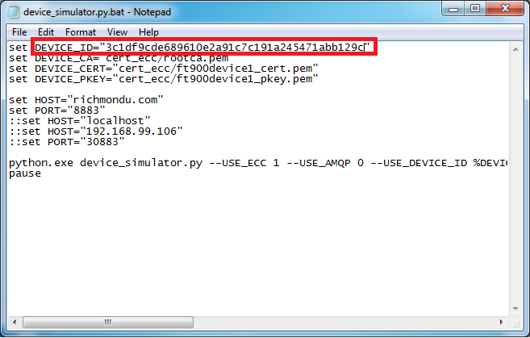
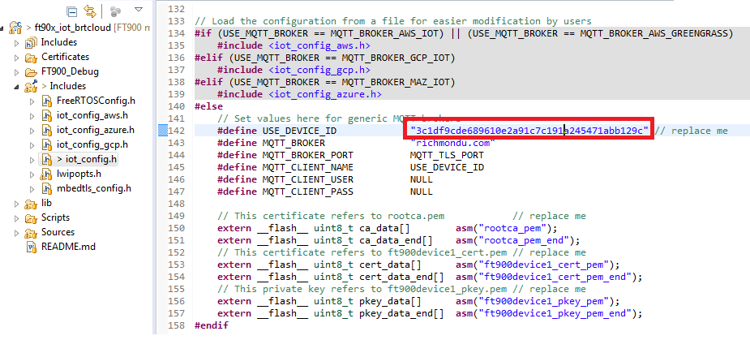
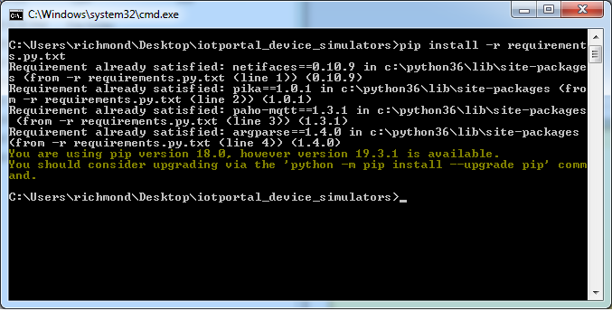
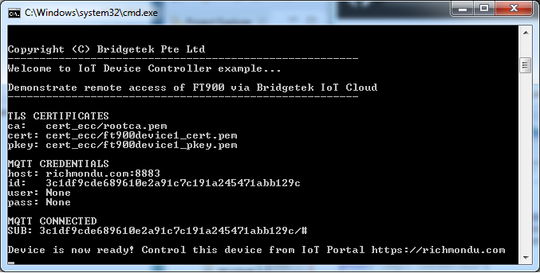

# User Guide:

This page contains a step-by-step tutorial on <b>how to use the IoT Portal</b> including <b>how to use the device simulators</b> or FT900 device module. 

### Step-by-step guide:

0. Access the IoT portal.

1. Create an account and login.

2. Register a device (Registering a device will return a unique DEVICE_ID, DEVICE_SERIAL, DEVICE_MACADD).

    

    To add a device, click on the "+" button on the top right of the window.

    

    Type a name for the device. Ex. "Smart Device 1"

    

    Wait for the device to be registered. A popup up window will appear that the device has been registered.

    

    Copy the DEVICE ID by double clicking on it and typing Ctrl+C.
    

3. Set the DEVICE_ID, DEVICE_SERIAL, DEVICE_MACADD and DEVICE_SECRETKEY on the device then run it.

    <b>Refer to corresponding sections below for setup instructions for the device simulators and FT900 device.</b>
    
    - Device simulator (Python) - <b>device_simulator.py.bat</b>
    
        
    
    - FT900 device (FT900RevC or IoTModule) - <b>iot_config.h</b>

        

# Device simulator (Python):

### Setup

1. Install the latest Python 3.X.X from https://www.python.org/downloads/

    

    After installation, open a command prompt and type "Python". You should see the version of the "Python" installed.
    Note that I'm using Python 3.6.6.

2. Install the required python libraries of the application:

    - pip install -r requirements.py.txt OR
    - python pip install -r requirements.py.txt

    

### Test

1. Update DEVICE_ID, DEVICE_SERIAL, DEVICE_MACADD and DEVICE_SECRETKEY in <b>device_simulator.py.bat</b> (or device_simulator.py.sh for Linux/MacOS)

   NOTE: To get a DEVICE_ID, DEVICE_SERIAL, DEVICE_MACADD, you must first register a device in the IoT Portal.

    

2. Update USER and PASS in <b>device_simulator.py.bat</b> (or device_simulator.py.sh for Linux/MacOS)

    <b> NOTE: After implementing additional security measures in the backend, device also needs to provide the MQTT username and MQTT password with the UUID and SerialNumber, respectively. </b>

    - DEVICE_ID = UUID
    - USER = UUID
    - PASS = Serial Number
    - HOST = Use prod or dev hostname

3. Run <b>device_simulator.py.bat</b> (or device_simulator.py.sh for Linux/MacOS)

    

