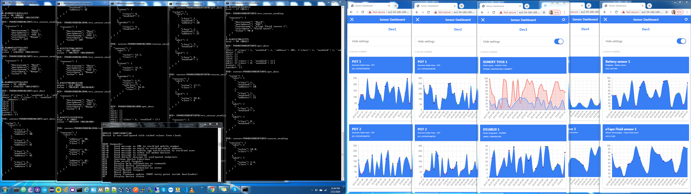
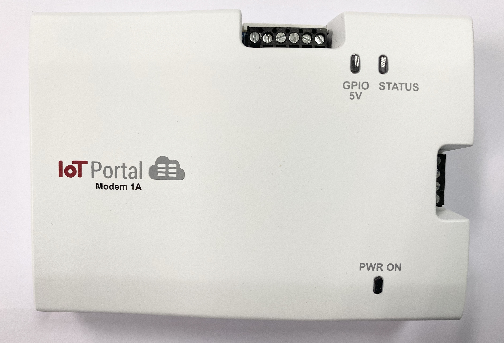
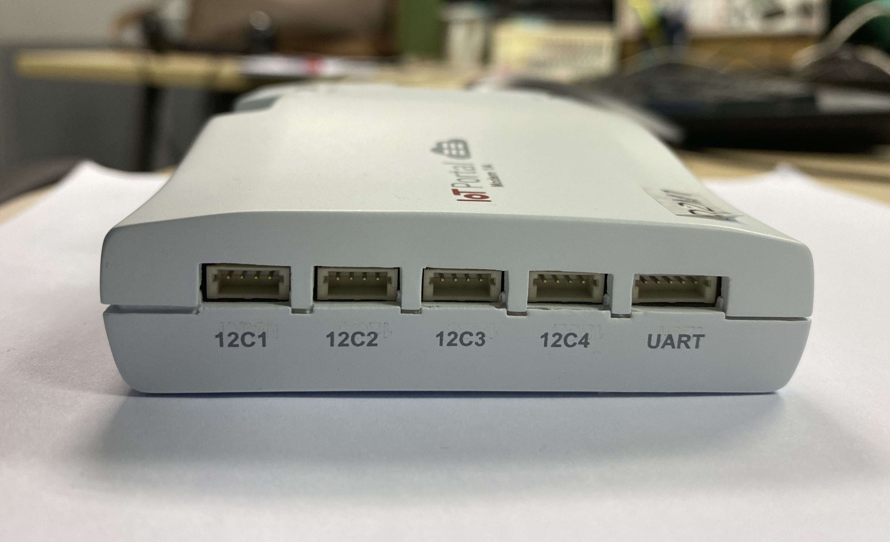
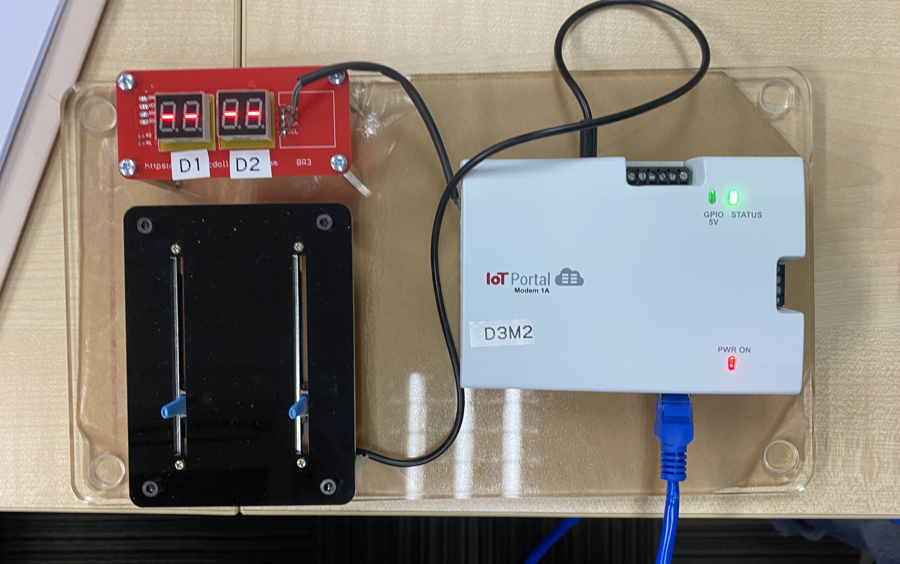
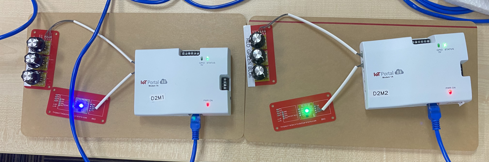

# Embedded World 2020 Demo Documentation

Below contains the 4 demo setups for Embedded World 2020 in Germany. 

All 4 setups can be simulated by the device simulator. 
The device simulator was used to <b>stress test the backend using the web app</b> and was successfully running for 2.5 days over a weekend (Friday night to Monday morning).

  

The 5 device simulators publishes sensor data at rate of 5 seconds interval while the 5 webapps polls the sensor dataset for graphing at 5 seconds interval too.
On the AWS EC2 side, the CPU usage is as follows:

    - X=5 -> ec2 cpu usage 5%  -> tested stable for ~2.5days (weekend test)
    - X=3 -> ec2 cpu usage 7%  -> tested stable for ~12 hours (Monday night test)
    - X=1 -> ec2 cpu usage 15% -> to test stability

  

Demo setups:

Note: MENOS messaging stands for Mobile, Email, (push) Notification, mOdem (device), Storage

1.  Demo1 - demonstrates <b>sensor graphing</b> and <b>sensor thresholding (w/MENOS triggering)</b> of ADC/Onewire/TProbe sensors

        Dev1
            ADC - QS-FS Wind sensor 1 (Anemometer)
                Dual Threshold
                Threshold: min 0.1, max 99.9, out of range
                Alert: once
                Notification: 
                    Messages: message on activation, message on deactivation
                    Recipients: send email

            Onewire - DS18B20 1 (Temperature)
                Dual Threshold
                Threshold: min 0.1, max 39.9, out of range
                Alert: once
                Notification: 
                    Messages: message on activation, message on deactivation
                    Recipients: send email

            TProbe - Sonoff TH16 (Temperature and Humidity)
                Temperature
                    Single Threshold
                    Threshold: value 39.9
                    Alert: once
                    Notification: 
                        Messages: message on activation, message on deactivation
                        Recipients: send email
                Humidity
                    Single Threshold
                    Threshold: value 99.9
                    Alert: once
                    Notification: 
                        Messages: message on activation, message on deactivation
                        Recipients: send email

2.  Demo2 - demonstrates <b>sensor forwarding</b> from 3 I2C INPUT sensors of 1 device to 1 I2C OUTPUT sensor of another device

        Dev1
            I2C POT 1
                Mode: Continuous
                Hardware: Demo2Dev2
            I2C POT 2
                Mode: Continuous
                Hardware: Demo2Dev2
            I2C POT 3
                Mode: Continuous
                Hardware: Demo2Dev2
            I2C LED 1
                Usage: RGB as component
                R: Demo2Dev2 > I2C > POT 1 > Range
                G: Demo2Dev2 > I2C > POT 2 > Range
                B: Demo2Dev2 > I2C > POT 3 > Range

        Dev 2
            I2C POT 1
                Mode: Continuous
                Hardware: Demo2Dev1
            I2C POT 2
                Mode: Continuous
                Hardware: Demo2Dev1
            I2C POT 3
                Mode: Continuous
                Hardware: Demo2Dev1
            I2C LED 1
                Usage: RGB as component
                R: Demo2Dev1 > I2C > POT 1 > Range
                G: Demo2Dev1 > I2C > POT 2 > Range
                B: Demo2Dev1 > I2C > POT 3 > Range

3.  Demo 3 - demonstrates <b>sensor forwarding</b> from 2 ADC INPUT sensors of 1 device to 2 I2C OUTPUT sensors of another device

        Dev1
            ADC Battery sensor 1
                Mode: Continuous
                Hardware: Demo3Dev2
            ADC Fluid sensor 1
                Mode: Continuous
                Hardware: Demo3Dev2
            I2C DIG2 1
                Endpoint: Hardware
                Hardware: Demo3Dev2 > ADC > Battery sensor 1 > Battery Level
            I2C DIG2 2
                Endpoint: Hardware
                Hardware: Demo3Dev2 > ADC > eTape Fluid sensor 1 > Fluid Level

        Dev2
            ADC Battery sensor 1
                Mode: Continuous
                Hardware: Demo3Dev1
            ADC Fluid sensor 1
                Mode: Continuous
                Hardware: Demo3Dev1
            I2C DIG2 1
                Endpoint: Hardware
                Hardware: Demo3Dev1 > ADC > Battery sensor 1 > Battery Level
            I2C DIG2 2
                Endpoint: Hardware
                Hardware: Demo3Dev1 > ADC > eTape Fluid sensor 1 > Fluid Level

4.  Demo 4 - demonstrates <b>MENOS notification triggering via UART</b>

        Dev1
            Set CONFIG_SEND_NOTIFICATION_PERIODICALLY to True in device_simulator.py
            UART
                Notification Recipient: Mobile (SMS), Email, Notification (Push Notification)
            Type AT+M
            Type AT+E
            Type AT+N (Requires logging in on Android or IOS mobile app)

